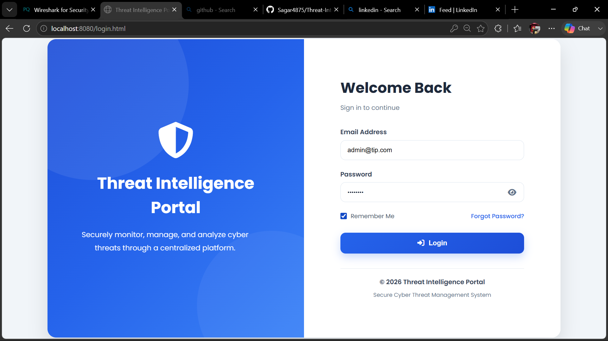
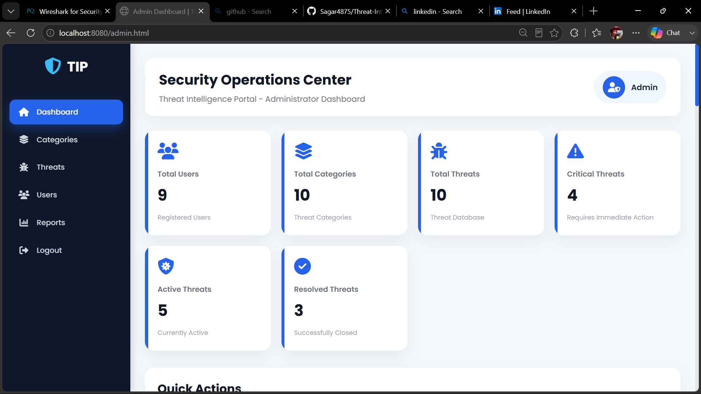
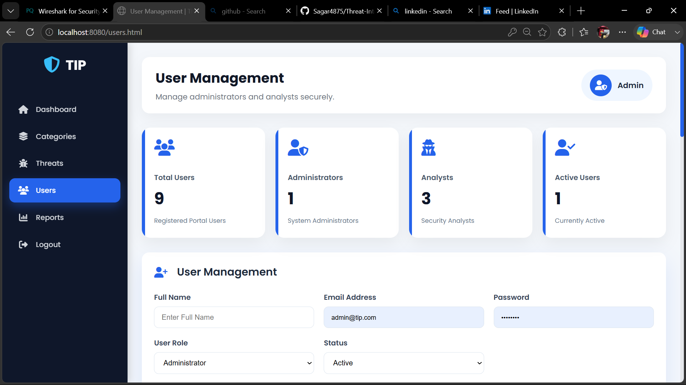
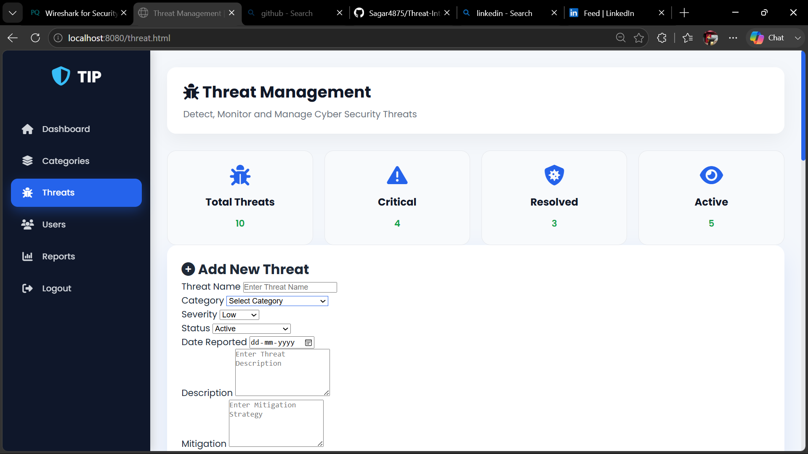
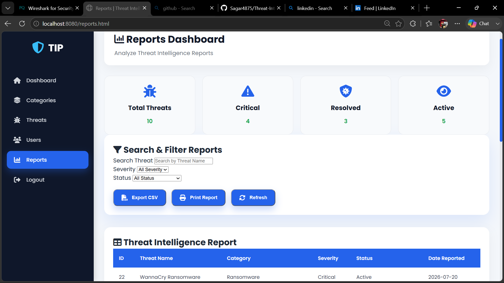

# 🛡️ Threat Intelligence Portal

<div align="center">

### Secure Web-Based Cyber Threat Management Platform

A modern enterprise-grade **Threat Intelligence Portal** developed using **Spring Boot**, **Spring Security**, **JWT Authentication**, **Hibernate**, and **MySQL** to securely manage cyber threats, users, and reports through Role-Based Access Control (RBAC).


</div>

---

# 📖 Overview

The **Threat Intelligence Portal (TIP)** is a secure enterprise web application designed to centralize cyber threat management within an organization.

The system enables security teams to securely manage cyber threats, users, categories, and reports while protecting sensitive information using modern security mechanisms such as **JWT Authentication**, **Spring Security**, **BCrypt Password Encryption**, and **Role-Based Access Control (RBAC)**.

Instead of maintaining cyber incidents in spreadsheets or multiple systems, organizations can efficiently monitor, classify, and manage threats through one centralized platform.

---

# 🎯 Project Objectives

- Centralized Threat Management
- Secure Authentication & Authorization
- User & Role Management
- Threat Monitoring
- Threat Reporting
- Enterprise Security Implementation
- REST API Development
- Secure Database Management

---

# ✨ Key Features

## 🔐 Authentication

- Secure Login
- JWT Authentication
- BCrypt Password Encryption
- Secure Session Handling

---

## 👥 User Management

- Create Users
- Update Users
- Delete Users
- Role Assignment
- Active / Inactive Status

---

## 🚨 Threat Management

- Add Threats
- Update Threats
- Delete Threats
- Search Threats
- Severity Classification

---

## 📂 Category Management

- Create Categories
- Update Categories
- Delete Categories

---

## 📊 Dashboard

- Total Users
- Total Threats
- Critical Threat Count
- Active Threat Count
- Resolved Threat Count

---

## 📈 Reports

- Threat Summary
- Search & Filter
- Threat Statistics
- Report Generation

---

# 🔒 Security Features

- JWT Authentication
- Spring Security
- BCrypt Password Encryption
- REST API Protection
- Role-Based Access Control
- Secure User Authentication
- Protected Endpoints
- Secure Database Storage

---

# 🏗️ System Architecture

```text
                    Users
                       │
                       ▼
        HTML • CSS • JavaScript
                       │
                       ▼
              REST API Requests
                       │
                       ▼
               Spring Boot Backend
                       │
        Spring Security + JWT Filter
                       │
                       ▼
               Hibernate (JPA ORM)
                       │
                       ▼
                 MySQL Database
```

---

# 🛠 Technology Stack

### Frontend

- HTML5
- CSS3
- JavaScript

### Backend

- Java 17
- Spring Boot
- Spring MVC
- Spring Security
- Hibernate (JPA)
- JWT Authentication

### Database

- MySQL

### Tools

- IntelliJ IDEA
- Maven
- Postman
- Git
- GitHub
- MySQL Workbench

---

# 👨‍💻 User Roles

## 👑 Administrator

- Manage Users
- Manage Categories
- Manage Threats
- View Reports
- Dashboard Analytics
- Role Management

---

## 🛡️ Security Analyst

- Secure Login
- View Dashboard
- Manage Threat Information
- View Reports

---

# 📂 Project Structure

```text
src
├── controller
├── dto
├── entity
├── repository
├── security
├── service
├── resources
│   ├── static
│   └── application.properties
```

---

# 📸 Application Screenshots

> Login Page


> Administrator Dashboard

> User Management

> Threat Management

> Reports Dashboard
> 


# ⚙️ Installation

### Clone Repository

```bash
git clone https://github.com/Sagar4875/Threat-Intelligence-Portal.git
```

### Configure Database

Create MySQL Database

```sql
CREATE DATABASE tip_db;
```

Update

```properties
spring.datasource.url=jdbc:mysql://localhost:3308/tip_db
spring.datasource.username=YOUR_USERNAME
spring.datasource.password=YOUR_PASSWORD
```

### Run

```bash
mvn spring-boot:run
```

Open

```
http://localhost:8080
```

---

# 🚀 Future Enhancements

- AI-Based Threat Detection
- Machine Learning Integration
- SIEM Integration
- Threat Intelligence API Integration
- Multi-Factor Authentication (MFA)
- Email Notifications
- Cloud Deployment
- Mobile Application
- Real-Time Threat Feed
- Incident Assignment Workflow

---

# 📚 Learning Outcomes

This project strengthened my knowledge of:

- Enterprise Java Development
- Spring Boot
- Spring Security
- JWT Authentication
- Hibernate ORM
- RESTful APIs
- MySQL Database Design
- Secure Coding Practices
- Role-Based Access Control
- Cybersecurity Fundamentals

---

# 👨‍🎓 Developer

## **Sagar Dhoke**

**B.Tech – Computer Science & Engineering (Cyber Security)**

Lovely Professional University

📧 Email: *(Add your email if you want recruiters to contact you.)*

🐙 GitHub

https://github.com/Sagar4875

💼 LinkedIn

https://www.linkedin.com/in/YOUR-LINKEDIN-USERNAME/

---

# ⭐ Support

If you found this project helpful, please consider giving it a **Star ⭐** on GitHub.

---

# 📄 License

This project is developed for **educational and learning purposes**.